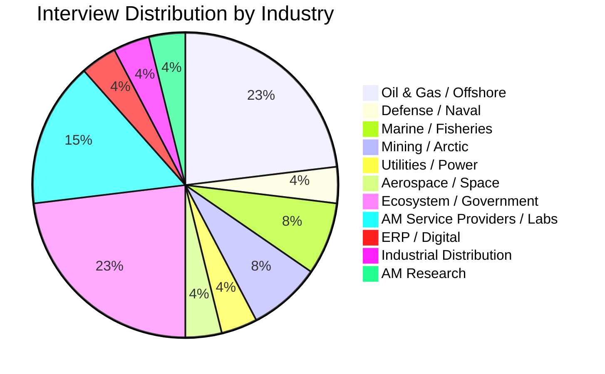

# AddManuChain Interview Synthesis Report
## Comprehensive Findings from 26 Customer Discovery Interviews

**Program:** Lab2Market | **Date:** February 12, 2026  
**Researcher:** Mahmoud Kiasari | **Affiliation:** Dalhousie University  
**Total Interviews Analyzed:** 26 (across 14 industries, 4 countries)

---

## Executive Summary

Over 26 customer discovery interviews were conducted between January and February 2026, engaging stakeholders across marine/offshore, defense, mining, utilities, aerospace, advanced manufacturing, and ecosystem organizations. This synthesis distills the recurring themes, validates or challenges core hypotheses, and refines the platform's strategic direction.

### Top 5 Strategic Findings

1. **IP protection is the #1 adoption barrier** — universally cited across all industries, more important than cost or time (Interviews 13, 14, 15, 18, 20, 23, 25, 27)
2. **Working capital liberation (not warehouse savings) is the CFO-level ROI driver** — reframes the entire value proposition from operational to financial (Interviews 15, 18, 25, 30)
3. **Equinor Bay du Nord is the ideal beachhead** — Greenfield project with no legacy warehouse, already doing AM in Norway, will break down barriers for other operators (Interview 27)
4. **AI should enhance supply chain fundamentals, not replace them** — multiple interviewees cautioned against leading with AI before solving the underlying process (Interviews 25, 28)
5. **Certification is a 2+ year gatekeeper** — but utilities self-certify and temporary parts bypass this entirely (Interviews 23, 27, 30)

---

## 1. Interview Landscape

### 1.1 Interviewee Map

| # | Interviewee | Organization | Industry | Type |
|---|-------------|-------------|----------|------|
| 1 | Bassey Amba | — | Oil & Gas | Customer |
| 2 | Khashayar Morshed | Dalhousie University | AM Lab / Research | Lab |
| 3 | David Waldbillig | InnoTech Alberta | AM Research / Oil Sands | Expert |
| 4 | Jason Power | Noble Corp → Valaris | Offshore Drilling | Customer |
| 5 | Sean Morgan | Atlantic XL | AM Service Provider | Facility |
| 6 | John Lidstone | Atlantic XL | AM Service Provider | Facility |
| 7 | Fanny Charreteur | PRIMA Québec | Ecosystem / Materials | Expert (email) |
| 8 | Frank DeFalco | NGen / Canada Makes | Ecosystem | Expert |
| 9 | Mark Kirby | MSAM / Canada Makes | Ecosystem/Technical | Expert |
| 10 | Jordan Cumming | — | AM / Consulting | Expert |
| 11 | Dr. Ali Nasiri | Dalhousie University | Academic / AM Research | Expert |
| 12 | Tony Jabbour / Jon | Clearwater Seafoods | Marine / Fisheries | Customer |
| 13 | Lee Vessey | Thales Canada (Navy) | Defense / Naval | Customer |
| 14 | Nicole Rathie | NGen / Canada Makes | Ecosystem | Expert |
| 15 | Mikhail Gladkikh | OMV Austria | Oil & Gas | Customer |
| 16 | Harvey Doane | Maritime Launch / Space | Aerospace / Space | Expert |
| 17 | Jean-Michel Fortin | Agnico Eagle Mines | Mining / Arctic | Customer |
| 18 | Chris | OMV Austria | Oil & Gas | Customer |
| 19 | Fanny Charreteur | PRIMA Québec | Ecosystem / Materials | Expert |
| 20 | Nichelle & Dustin | The Assembly Studio (PEI) | Digital Inventory | Competitor/Partner |
| 23 | Jim Granger | MAN Energy Solutions | Marine Propulsion | Customer/OEM |
| 25 | Kwadwo Ampofo | Deloitte Canada | SAP / ERP Architecture | Expert |
| 27 | Keith Healey | ERINL / Sustainable Jobs | Government R&D | Expert |
| 28 | Andrew Smith | Design Smith / JVPLabs | QA / Manufacturing | Expert |
| 29 | Darren Wood | Proax Technologies | Industrial Distribution | Customer |
| 30 | Adam Chubbs | Frobisher Energy / Ecotex | Utilities / Mining | Customer |

### 1.2 Industry Coverage

---

## 2. Hypothesis Validation Summary

### 2.1 Strongly Validated Hypotheses

| Hypothesis | Evidence Count | Key Quote |
|------------|---------------|-----------|
| **IP protection is primary adoption barrier** | 10 interviews | *"It doesn't matter how strong the NDA is. It's like, no."* — Jim Granger (23); *"OEM has relinquished the IP… or IP is void or expired"* — John Lidstone (6) |
| **Certification is multi-year gatekeeper** | 8 interviews | *"2 years minimum"* — Jim Granger (23); **86 templates, 4-year certification** — John Lidstone (6); *"ASTM standards are out of date"* — John Lidstone (6) |
| **Working capital is the real cost driver** | 6 interviews | *"If it becomes a CFO problem, that's when decision makers do anything"* — Kwadwo (25); **$30-50M inventory per vessel** — Jason Power (4) |
| **Digital inventory gap exists for large OEMs** | 5 interviews | *"Hundreds of thousands of parts… they don't know what is"* — Frank DeFalco (8); *"Months → weeks with digital inventory"* — John Lidstone (6) |
| **Workforce knowledge gap driving AI adoption** | 5 interviews | *"Those guys are gone"* — Jim Granger (23); *"Lack of human resources"* — Khashayar (2) |
| **Obsolescence is a primary AM adoption driver** | 4 interviews | *"I deal with that all the time"* — Darren Wood (29); MOC process — Kwadwo (25) |
| **Predictive maintenance + supply chain = unmet need** | 4 interviews | *"No one in the business has accomplished that yet"* — Jason Power (4); validated by John Lidstone (6), Adam Chubbs (30) |
| **Sovereign resilience resonates (defense)** | 3 interviews | *"If you buy an F-35, they could turn it off"* — Frank DeFalco (8) |
| **Temporary parts = viable beachhead** | 3 interviews | Navy on-ship AM validated by Jim Granger (23), Lee Vessey (13) |
| **Integrators (not operators) are the target** | 2 interviews | *"The best target would be integrators"* — Jason Power (4); OEM engagement blocker — John Lidstone (6) |

### 2.2 Challenged or Rejected Hypotheses

| Hypothesis | Challenge | Source |
|------------|-----------|--------|
| **O&G operators lack spare parts coordination** | Rigs already share spares via helicopter within 100km | Andrew Smith (28) |
| **AI should lead the value proposition** | *"AI will just muddy the waters… solve the fundamentals first"*; *"AI standalone could not be useful"* | Kwadwo Ampofo (25), Jason Power (4) |
| **AM works for all part categories** | Only viable for <50 units; NOT for heavy metal structural parts | Andrew Smith (28), Jim Granger (23) |
| **Mining is a good early target** | Volume mismatch, multi-stakeholder consensus, 12-month ordering cycles | Jean-Michel Fortin (17) |
| **Big O&G companies feel downtime pain** | *"We have deep pockets. We don't care."*; operators are reactive on technology | Assembly Studio (20), Jason Power (4) |
| **Network building is the problem** | *"No specific problem that solution solves"* — informal NL AM network already works | Andrew Smith (28) |
| **Fully digital warehouse is realistic** | *"You'd end up with a mid-2 stock scenario"* — hybrid model needed | Kwadwo Ampofo (25) |
| **AM will replace traditional manufacturing soon** | *"Till couple of decades AM can't be replaceable that much"*; still in education/testing | Khashayar (2), David Waldbillig (3) |
| **Canadian companies are ready for digital transformation** | Only 20% of 619 advanced materials companies benefited from digital programs; 89% cite investment cost | Fanny Charreteur / PRIMA Québec (7) |
| **Target end-user operators directly** | End users don't decide manufacturing methods; must target integrators/OEMs | Jason Power (4) |

### 2.3 New Hypotheses Generated

| ID | Hypothesis | Source Interview |
|----|-----------|------------------|
| NH.26 | Working capital is the primary ROI driver (not storage costs) | Kwadwo (25) |
| NH.27 | Insurance stock → digital conversion is the biggest opportunity | Kwadwo (25) |
| NH.28 | CFO is the primary decision maker (not supply chain manager) | Kwadwo (25) |
| NH.33 | Obsolete parts have no IP barriers | Kwadwo (25) |
| NH.38 | Oil & Gas already has informal parts-sharing networks | Andrew Smith (28) |
| NH.41 | Greenfield projects are better beachheads than Brownfield | Keith Healey (27) |
| NH.42 | Consortium model reduces OEM IP concerns | Keith Healey (27) |
| NH.43 | Per-print royalty model makes OEMs willing to release IP | Keith Healey (27) |
| H50 | Risk categorization system is MUST-HAVE for market entry | Jason Power (4) |
| H53 | Predictive maintenance + supply chain integration = biggest unmet need | Jason Power (4) |
| H54 | AI feasibility/suitability assessment is most valuable AI feature | Jason Power (4), John Lidstone (6) |
| H56 | Demo-to-production tracking system needed | Frank DeFalco (8) |
| H57 | Sovereign manufacturing risk dashboard | Frank DeFalco (8) |
| H-IP | AI-powered IP/patent search for expired/void designs | John Lidstone (6) |
| H-CRIT | Digital inventory adoption follows a part criticality curve | John Lidstone (6), David Waldbillig (3) |
| H-OEM | OEM partnership strategy is THE critical success factor | John Lidstone (6) |

---

## 3. Key Themes

### 3.1 IP Protection: The Universal Blocker

**Finding:** Every industry stakeholder — from O&G to defense to manufacturing — identified IP protection as the primary barrier to digital inventory adoption.

**Evidence:**
- **Jim Granger (MAN Energy):** *"15 years at General Electric taught me — companies don't want to share IP. It doesn't matter how strong the NDA is."*
- **John Lidstone (Atlantic XL):** *"You have to make sure the OEM has relinquished the IP… or prove that the IP is void or expired."* — IP clearance is a multi-step manual process blocking AM adoption
- **Khashayar (Dalhousie Lab):** Even within academic networks, materials are sent as "black box" to other universities — confidentiality is paramount
- **Nicole Rathie (NGen):** Advocated for on-premise processing (Select AM model) over cloud-based repositories
- **Assembly Studio:** Built their entire business model around local encrypted storage (Raspberry Pi 5, no cloud)
- **Keith Healey (ERINL):** *"OEMs see it as a threat to a loss of business. Operators fear legal consequences."*
- **Kwadwo Ampofo (Deloitte):** Obsolete parts are the workaround — *"Nobody cares about copyright when nobody's manufacturing it"*

**Solution Framework:**
1. **Short-term:** Focus on obsolete parts (no IP barriers) + AI-powered patent/IP search for expired designs (John Lidstone)
2. **Medium-term:** Consortium model with per-print royalties to OEMs
3. **Long-term:** On-premise encrypted processing (Assembly Studio model)

---

### 3.2 The Working Capital Reframe

**Finding:** The ROI conversation must shift from "reduce warehouse costs" to "liberate working capital."

**Evidence:**
- **Kwadwo Ampofo:** *"More spare parts = increased working capital with NO benefits. If it becomes a CFO problem, that's when decision makers do anything."*
- **Adam Chubbs:** First quantitative data — **$4-5M inventory for $50M asset base** (8-10% ratio)
- **OMV Austria (Chris/Mikhail):** 15% ROI threshold required for any technology investment
- **Assembly Studio:** Confirmed working capital optimization as core value proposition

**Quantified ROI Model:**
| Metric | Value | Source |
|--------|-------|--------|
| Inventory-to-asset ratio | 8-10% | Adam Chubbs (30) |
| **Inventory per offshore vessel** | **$30-50M** | Jason Power (4) |
| **Vessel value** | **$500M-$1B** | Jason Power (4) |
| Inventory holding cost | 20-30%/year of value | Kwadwo Ampofo (25) |
| $10M inventory example | $2.5M/year holding cost | Kwadwo's calculation |
| 30% inventory reduction | $3M freed + $750K/year saved | Kwadwo's calculation |
| Preservation costs | Ongoing (unquantified) for $200K turbos | Adam Chubbs (30) |
| Mining downtime | $500K-$1M/day | Assembly Studio (20) |
| **Offshore drilling downtime** | **$500K-$1M/day** | Jason Power (4) |

---

### 3.3 Customer Segmentation Matrix

Based on all interviews, a clear segmentation emerged:

| Segment | Pain Level | AM Readiness | Ado
ption Timeline | Key Barrier | Best Approach |
|---------|-----------|-------------|-------------------|-------------|---------------|
| **Defense/Naval** | 🔴 Critical | ✅ High | 1-2 years | Sovereign capability | Government anchor tenant |
| **Greenfield O&G (Equinor)** | 🔴 High | ✅ High | 2-3 years | Regulatory pathway | Beachhead customer |
| **Remote Utilities** | 🟡 High | ✅ Medium | 2-3 years | Self-certification specs | AI asset intelligence |
| **Marine Distributors** | 🟡 Medium | ⚠️ Medium | 2-4 years | Time vs helicopter | Custom fabricated parts |
| **Brownfield O&G (Suncor)** | 🟢 Low urgency | ⚠️ Low | 5+ years | Existing infrastructure | Wait for Equinor proof |
| **Tier 1 O&G Majors** | 🟢 Very low | ❌ Very low | 5+ years | *"Deep pockets, don't care"* | Don't target directly |
| **Mining (Arctic)** | 🔴 High pain | ❌ Low readiness | 5+ years | Volume mismatch | AI inventory only (no AM) |

---

### 3.4 The Certification Landscape

**Finding:** Certification is a 2+ year process, but multiple pathways exist.

| Pathway | Timeline | Applies To | Source |
|---------|----------|-----------|--------|
| Lloyd's Register full certification | 2+ years (86 templates) | Marine structural parts | John Lidstone (6) |
| DNV/ABS/Lloyd's full certification | 2+ years | Marine structural parts | Jim Granger (23) |
| C-NLOPB + C-CORE validation | 1+ years (if engaged early) | Offshore NL operations | Keith Healey (27) |
| CSA/UL certification | 6-18 months | Electrical components | Keith Healey (27) |
| Self-certification (utilities) | Internal process | Non-public utility environments | Adam Chubbs (30) |
| Temporary/non-certified parts | Immediate | Emergency naval/marine use | Lee Vessey (13) |
| CNC-equivalent standards | Existing framework | Treat AM like CNC machining | Andrew Smith (28) |

**Critical Insight (Keith Healey):** *"If you engage the regulator and certified authority along the way, you'll break down those barriers. If you just pass it over after, it'll take a year, maybe year and a half."*

---

### 3.5 The AI Positioning Debate

Interviewees were divided on AI's role. The synthesis reveals a nuanced position:

| Position | Advocates | Key Argument |
|----------|-----------|-------------|
| **AI is critical** | Jim Granger, Keith Healey, Lee Vessey | Workforce knowledge gap makes AI essential; *"Those guys are gone"* |
| **AI should not lead** | Kwadwo Ampofo, Andrew Smith | *"Solve supply chain fundamentals first. AI will muddy the waters."* |
| **AI for prediction, not QA** | Andrew Smith, Adam Chubbs | Predictive maintenance yes; quality assurance has hallucination risk |
| **Proprietary AI only** | Jim Granger (MAN), OMV | *"We've tried to narrow it to our data instead of large language models"* |

**Recommended Position:** AI as an enhancement layer on top of proven supply chain fundamentals — specifically MRP integration, buffer management, and demand-driven replenishment. Never lead with "AI-powered" in pitch. Start with AI inventory optimization (Jason Power) and feasibility assessment (John Lidstone), then layer in AM capability.

---

### 3.6 The Integrator Pivot

**Finding (Jason Power, Interview 4):** End-user operators (Noble, Shell, etc.) do NOT decide which manufacturing methods to use. The real decision-makers are **integrators/OEMs** (HMH, NOV, Baker Hughes, Weatherford).

> *"The idea of using AM goes back to whether individual supplier vendors would like to use that or not. In the concept of big industries like oil and gas, it's not that meaningful [to target operators]."*

**Supply Chain Reality:**
- Integrators assemble packages from sub-vendors; even "simple" pumps are sold as complete packages
- Operators buy packages, don't specify manufacturing method
- One integrator partnership = access to entire operator customer base
- Operators are **reactive** on technology: *"The company should go to them and should sell them capabilities"*

**Boom/Bust Cycle Dynamics:**
- **Boom:** *"Cost doesn't matter, just get parts fast"* — AM value = speed
- **Bust:** *"Optimize costs, reduce inventory"* — AM value = cost reduction
- Value proposition must work in **both** phases

---

### 3.7 Québec Digital Transformation Gap

**Finding (Fanny Charreteur, PRIMA Québec Survey):** Canadian advanced materials companies face a significant digital adoption lag.

**PRIMA Québec Survey Data (39 responses from 146 organizations):**
| Metric | Value |
|--------|-------|
| Interest in new technologies | Nearly 100% |
| Adopted new tech in past 5 years | Majority |
| Adopted digital tools | 77% |
| Adopted AI/ML technologies | 60% |
| **Investment cost** as barrier | **89%** |
| **ROI uncertainty** as barrier | **55%** |
| Workforce shortages as barrier | 32% |
| Lack of support/guidance as barrier | 21% |
| Companies benefiting from Digital Transformation Offensive | ~20% of 619 |
| Direct AM companies in survey | 1 of 39 |

**Strategic Implication:** While interest is universal, the cost and ROI uncertainty barriers align with the working capital reframe — the pitch must lead with quantified ROI (15%+ per OMV requirement).

---

## 4. Competitive & Partnership Intelligence

### 4.1 Competitive Landscape

| Player | Focus | Stage | Threat Level | Strategy |
|--------|-------|-------|-------------|----------|
| **Canada Makes / Select AM** | Part identification for AM suitability | In development (not proven) | 🟡 Medium | Partner — complement, don't compete |
| **The Assembly Studio (PEI)** | Secure digital inventory (IP focus) | 4 months old, pilot | 🟢 Low (complementary) | Partnership — different segments |
| **Fieldnode** | SaaS digital inventory for O&G | Live (ConocoPhillips, Equinor, Shell, BP) | 🔴 HIGH | Differentiate on certification/AI |
| **Pelagus 3D** | Digital spare parts marketplace | Active but struggling with OEMs | 🟡 Medium | Exploit their OEM relationship weakness |
| **Atlantic XL** | Metal AM for offshore oil | Active (expensive) | 🟡 Medium | Potential consortium member |
| **Baker Hughes (Germany)** | Digital inventory for O&G; 450+ qualified AM parts | Operational in Europe | 🔴 High (if enters Canada) | Canadian differentiation |
| **NGen AI Mapping Tool** | Value chain mapping | 65% accuracy (too low) | 🟢 Low | Contribute AI expertise |
| **Engineered Intelligence** | AI asset intelligence for utilities | Active development | 🟢 Low (partner) | Integrate digital inventory |

### 4.2 Partnership Strategy

**Priority Partners:**
1. **Canada Makes** — Integrate with Select AM tool; position as "next layer"
2. **The Assembly Studio** — Customer referrals (they take general mfg, we take offshore); co-content
3. **NGen** — Amplification channel; Hannover Messe 2026 booth ($2K)
4. **Engineered Intelligence (Adam Chubbs)** — AI asset intelligence + digital inventory = closed loop
5. **ERINL** — Funding for DNV/Lloyd's certification costs

---

## 5. Refined Value Proposition

### 5.1 Before vs. After Interviews

| Dimension | Before Interviews | After Interviews |
|-----------|-------------------|-----------------|
| **Core pitch** | "Digital inventory platform for AM parts" | "Supply chain intelligence platform freeing working capital through digital inventory" |
| **Lead message** | Technology-focused (AI, AM, digital) | Outcome-focused (working capital, downtime avoidance, sovereignty) |
| **Target buyer** | Supply chain manager / Engineer | **CFO** (working capital) + **VP Operations** (downtime) |
| **Target company** | All O&G, mining, marine | Equinor Bay du Nord (Greenfield beachhead) |
| **Part focus** | All spare parts | <50-unit, obsolete, non-structural, non-proprietary |
| **AI positioning** | Core differentiator | Enhancement layer on supply chain fundamentals |
| **IP solution** | Cloud-based repository | On-premise processing + consortium + per-print royalties |
| **Revenue model** | SaaS subscription | License fee + per-print royalty to OEMs |

### 5.2 Value Proposition by Stakeholder

| Stakeholder | Message | Metric |
|-------------|---------|--------|
| **CFO** | "Free up $X million in working capital by converting insurance stock to digital inventory" | 30-50% inventory reduction |
| **VP Operations** | "Eliminate 10-day emergency delivery delays with localized on-demand manufacturing" | Hours vs. days lead time |
| **VP Supply Chain** | "AI-optimized stock/print decisions integrated with your existing SAP/ERP" | MRP-native integration |
| **CTO / Innovation** | "Certified digital parts with full traceability — treat AM like CNC" | DNV/Lloyd's pathway |
| **Government/Defense** | "Sovereign manufacturing capability for critical supply chain resilience" | Canadian-made, no foreign dependence |

---

## 6. Go-to-Market Strategy (Refined)

### 6.1 Beachhead: Equinor Bay du Nord

**Why this is the ideal first customer (Keith Healey, Interview 27):**
- ✅ **Greenfield** — no legacy warehouse to compete with
- ✅ **Already doing AM in Norway** — proven organizational acceptance
- ✅ **Key contact identified** — Brad Elliott (Equinor NL, AM champion)
- ✅ **Network effect** — *"Will break down barriers with Suncor, ExxonMobil when they see what Equinor is doing"*
- ✅ **ERINL funding pathway** — Can fund certification costs
- ✅ **Regulatory first mover** — Will engage C-NLOPB, setting precedent

### 6.2 Expansion Sequence

### 6.3 Industry Fit Assessment

| Industry | Fit Score | Rationale | Timing |
|----------|-----------|-----------|--------|
| **Offshore O&G (Greenfield)** | ⭐⭐⭐⭐⭐ | No legacy, Equinor lead, ERINL funding | Now |
| **Defense / Naval** | ⭐⭐⭐⭐⭐ | Sovereign imperative, government budget, Lee Vessey champion | Now |
| **Remote Utilities** | ⭐⭐⭐⭐ | Self-certification, high logistics cost, AI partnership | 6 months |
| **Marine OEMs** | ⭐⭐⭐⭐ | Digital inventory proven (MAN), temporary parts validated | 1 year |
| **Space / Satellite** | ⭐⭐⭐ | Growing acceptance, mass optimization focus | 2 years |
| **General Manufacturing** | ⭐⭐ | Assembly Studio covers this; low urgency | 3+ years |
| **Mining** | ⭐ | Volume mismatch, multi-stakeholder, long sales cycle | Not viable |

---

## 7. Key Quantitative Data Points

| Metric | Value | Source |
|--------|-------|--------|
| Inventory-to-asset ratio | 8-10% | Adam Chubbs (30) |
| Inventory per offshore vessel | $30-50M | Jason Power (4) |
| Vessel value (offshore drilling) | $500M-$1B | Jason Power (4) |
| Inventory holding cost (annual) | 20-30% of inventory value | Kwadwo Ampofo (25) |
| Offshore downtime cost | $500K-$1M/day | Jason Power (4), Assembly Studio (20) |
| AM certification timeline | 2+ years (DNV/ABS/Lloyd's) | Jim Granger (23) |
| Lloyd's Register cert (Atlantic XL) | 4 years, 86 templates | John Lidstone (6) |
| AM cost-effective threshold | <50 units per design | Andrew Smith (28) |
| Digital inventory lead time reduction | Months → weeks | John Lidstone (6) |
| AM Demo Program success rate | Low ("most don't go anywhere") | Frank DeFalco (8) |
| Production AM case study | $1M/year (Onstream, titanium) | Frank DeFalco (8) |
| Emergency delivery (NL) | 10 days (Central Newfoundland) | Darren Wood (29) |
| ROI threshold (O&G) | 15% minimum | OMV Austria (15, 18) |
| Canadian AM awareness | "Almost zero" | Assembly Studio (20) |
| Companies understanding supply chain issue | 90%+ | Assembly Studio (20) |
| Mid-sized utility inventory | $4-5M | Adam Chubbs (30) |
| Québec digital tool adoption | 77% | PRIMA Québec survey (7) |
| Québec AI/ML adoption | 60% | PRIMA Québec survey (7) |
| **Investment cost** as barrier | **89%** | PRIMA Québec survey (7) |
| ROI uncertainty as barrier | 55% | PRIMA Québec survey (7) |
| Digital transformation program reach | ~20% of 619 companies | PRIMA Québec (7) |

---

## 8. Critical Quotes for Presentations

### On the Market Opportunity
> *"Almost everyone we talk to knows things need to be different. They don't have a concept of what that should be. They just know that their supply chain doesn't work."* — Dustin, Assembly Studio (20)

### On IP Protection
> *"The hurdle that I would see is a lot of companies don't want to share IP. It doesn't matter how strong the NDA is."* — Jim Granger, MAN Energy Solutions (23)

### On Working Capital
> *"If it becomes a CFO problem, that's when decision makers do anything about this."* — Kwadwo Ampofo, Deloitte (25)

### On the Beachhead Strategy
> *"The key to breaking into industries is with a new project. Equinor is Greenfield — they don't have a warehouse set up yet. That will break down barriers with other oil companies."* — Keith Healey, ERINL (27)

### On AI
> *"AI is great to improve a process that already exists. If the process doesn't exist, AI doesn't have a backbone."* — Kwadwo Ampofo, Deloitte (25)

### On Integrators vs. Operators
> *"The best target for this work would be integrators… if they have the capability to reduce the lead time, that is where more cost effective solution for them."* — Jason Power, Noble/Valaris (4)

### On Digital Inventory
> *"The moment you go for the scan and getting certifications, you enter the era of digital inventory… could decrease the time lead from months to weeks."* — John Lidstone, Atlantic XL (6)

### On Predictive Maintenance Gap
> *"No one in the business has accomplished [integrating predictive maintenance into supply chain] yet."* — Jason Power, Noble/Valaris (4)

### On AM Maturity
> *"Till couple of decades AM can't be replaceable that much."* — Khashayar, Dalhousie (2)

### On COVID Supply Chain Lessons
> *"Companies pivoted, invested to make it in Canada. When things came down, procurement went back to China. Companies went bankrupt."* — Frank DeFalco, NGen (8)

### On AM Part Selection
> *"You cannot target whole markets. You have to find your 5%."* — Jim Granger, MAN Energy Solutions (23)

### On Workforce Gap
> *"The real power of AI is that lack of technical expertise. Those guys are gone."* — Jim Granger, MAN Energy Solutions (23)

### On Digital Adoption Barriers
> *"89% cite investment costs, 55% cite ROI uncertainty… Québec companies still face a significant lag in digital adoption."* — Fanny Charreteur, PRIMA Québec (7)

---

## 9. Platform Architecture Implications

Based on all interviews, the platform must address:

| Requirement | Rationale | Priority |
|-------------|-----------|----------|
| **On-premise/encrypted IP processing** | Universal barrier; Assembly Studio & Select AM models | 🔴 Critical |
| **SAP/ERP MRP integration** | First mover opportunity; never been done (Kwadwo) | 🔴 Critical |
| **Per-print OEM royalty tracking** | Consortium model for IP release (Keith) | 🔴 Critical |
| **Certification document management** | 2+ year pathway; treat AM like CNC (Andrew) | 🟡 High |
| **AI-driven stock vs. print decisions** | Buffer management + MRP engine integration | 🟡 High |
| **Insurance stock identification** | Highest-ROI target; CFO-level business case | 🟡 High |
| **Working capital ROI calculator** | Quantify 15%+ ROI for CFO audience | 🟡 High |
| **Sovereign manufacturing dashboard** | Defense/government value proposition | 🟢 Medium |
| **Demo-to-production tracking** | NGen gap; institutional knowledge capture | 🟢 Medium |
| **Predictive maintenance integration** | Partner with existing platforms (Engineered Intelligence) | 🟢 Medium |

---

## 10. Immediate Next Steps

### Priority Actions

1. **Interview Brad Elliott (Equinor NL)** — Validate Bay du Nord AM plans, procurement timeline
2. **Apply to ERINL for certification funding** — Include C-NLOPB engagement plan, C-CORE validation
3. **Interview Poly Unity (Mark Gillingham)** — Key Atlantic Canada AM ecosystem leader
4. **Build CFO-focused ROI calculator** — Working capital liberation model with 15%+ ROI
5. **Draft Canada Makes partnership proposal** — "Next layer on top of Select AM"
6. **Contact CME Nova Scotia (David Hare)** — Get quantified emergency maintenance data
7. **Explore Engineered Intelligence partnership** — AI asset intelligence + digital inventory integration

### Research Priorities

1. **Baker Hughes digital inventory platform** — European competitor analysis
2. **Demand-Driven MRP (DDMRP) methodology** — Buffer management theory
3. **Obsolete parts IP law** — Legal framework for discontinued products
4. **Arctic warehouse operating costs** — Quantify heating + logistics for ROI model
5. **Non-certified marine part taxonomy** — Which parts bypass DNV/ABS/Lloyd's?

---

## Appendix: Interview Quality Ratings

| # | Interviewee | Quality | Strategic Value | Top Insight |
|---|-------------|---------|----------------|-------------|
| 4 | Jason Power | ⭐⭐⭐⭐⭐ | Fundamental pivot | Integrators are the target; predictive maintenance gap; $30-50M/vessel inventory |
| 8 | Frank DeFalco | ⭐⭐⭐⭐⭐ | Ecosystem gatekeeper | COVID lessons not learned; $1M/year Onstream case |
| 6 | John Lidstone | ⭐⭐⭐⭐⭐ | Technical validation | 86 cert templates; AI IP search; months→weeks digital inventory; Fieldnode/Pelagus intel |
| 25 | Kwadwo Ampofo | ⭐⭐⭐⭐⭐ | Technical feasibility | MRP integration never done; working capital reframe |
| 27 | Keith Healey | ⭐⭐⭐⭐⭐ | Beachhead identification | Equinor Bay du Nord; ERINL certification funding |
| 28 | Andrew Smith | ⭐⭐⭐⭐⭐ | Reality check | <50 units; O&G has helicopter sharing |
| 23 | Jim Granger | ⭐⭐⭐⭐ | OEM perspective | 2-year certification; "Amazon model" resonates |
| 30 | Adam Chubbs | ⭐⭐⭐⭐⭐ | Quantitative data | $4-5M inventory; utilities self-certify |
| 29 | Darren Wood | ⭐⭐⭐⭐⭐ | Network access | Poly Unity, Kraken, CMA introductions |
| 3 | David Waldbillig | ⭐⭐⭐⭐ | Competitive intel | Fieldnode, Baker Hughes, power generation opportunity |
| 7 | Fanny Charreteur | ⭐⭐⭐⭐ | Survey data | PRIMA Québec: 89% cost barrier, 77% digital adoption, 20% program reach |
| 13 | Lee Vessey | ⭐⭐⭐⭐ | Defense champion | Sovereign resilience; temporary parts |
| 20 | Assembly Studio | ⭐⭐⭐⭐ | Competitor intel | IP security #1; partnership opportunity |
| 14 | Nicole Rathie | ⭐⭐⭐⭐ | Ecosystem strategy | Government anchor tenant; Select AM model |
| 2 | Khashayar Morshed | ⭐⭐⭐ | Lab perspective | NDA barriers; AM immaturity; inter-lab "black box" testing |

---

*This document should be updated as additional interviews are conducted and hypotheses are further validated or rejected.*
