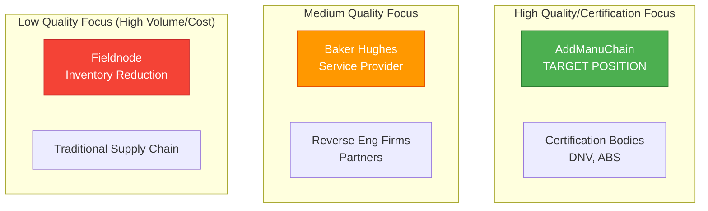

# Competitive Landscape Analysis
## Digital Inventory & Additive Manufacturing Platforms in Energy Sector

**Analysis Date:** January 28, 2026  
**Source:** David Waldbillig Interview + Web Research  
**Scope:** Energy sector (oil & gas, power generation)

---

## Executive Summary

The **digital inventory + additive manufacturing** space in the energy sector is rapidly consolidating around **platform models** rather than in-house capabilities. Energy companies are **outsourcing** to specialized platforms and service providers rather than building internal AM infrastructure.

**Key Findings:**
- 🔴 **Fieldnode** has captured major oil & gas players via consortium model
- 🟢 **Power generation** sector is underserved (opportunity)
- 🟡 **Service providers** (Baker Hughes) are partners, not competitors
- ⚠️ **Canada** is slower to adopt than US/Singapore (but validated model)

---

## Competitor #1: Fieldnode 🔴 DIRECT COMPETITOR

### Company Overview

| Attribute | Details |
|-----------|---------|
| **Founded** | 2020 (spin-off of Fieldmade AS) |
| **Business Model** | SaaS Platform - Digital Inventory for Spare Parts |
| **Primary Market** | Oil & Gas |
| **Revenue Model** | Subscription + transaction fees (estimated) |
| **Headquarters** | Norway |
| **Key Technology** | CAD file storage + on-demand AM production orchestration |

---

### Value Proposition

**Core Offering:**
> "Store digital files of parts (CAD) instead of large physical stocks. When a part is needed, produce it on-demand through additive manufacturing."

**Customer Benefits:**
1. **Reduce physical inventory costs** (warehouse savings)
2. **Reduce lead times** (weeks → days)
3. **Increase supply chain resilience** (local production)
4. **Enable customization** (digital modifications easier than physical retooling)
5. **Reduce waste** (produce only what's needed)

---

### Customers & Partners

**Industry Collaboration Project (ICP) Members:**

| Company | Joined | Type |
|---------|--------|------|
| ConocoPhillips | Jan 2023 | Oil & Gas Major |
| Equinor | Jan 2023 | Oil & Gas Major |
| Shell | Jan 2023 | Oil & Gas Major |
| TotalEnergies | Jan 2023 | Oil & Gas Major |
| Vår Energi | Jan 2023 | Oil & Gas Major |
| Woodside Energy | 2023 | Oil & Gas Major |
| ExxonMobil | Early 2024 | Oil & Gas Major |
| BP | Early 2024 | Oil & Gas Major |

**Integration Partners:**
- DNV (classification society - digital inventory recommendations)
- Equinor (procurement system integration - live production)

---

### Business Model Details

**Consortium Approach:**
- Industry Collaboration Project (ICP)
- Multiple oil & gas majors as co-investors/partners
- Shared digital inventory platform
- Industry-standard development (not proprietary)

**Strengths of Consortium Model:**
- ✅ Legitimacy (backed by industry leaders)
- ✅ Network effects (more users = more value)
- ✅ Shared IP (reduces individual company risk)
- ✅ Industry standardization (interoperability)

**Weaknesses of Consortium Model:**
- ❌ Slow decision-making (many stakeholders)
- ❌ Lowest common denominator features (consensus-based)
- ❌ Limited differentiation (standard for everyone)
- ❌ Hard to pivot quickly

---

### Technology Stack (Inferred)

Based on public information:
- **Digital File Storage:** Cloud-based CAD/technical data repository
- **Procurement Integration:** API connections to SAP, Oracle, etc.
- **Supplier Network:** AM service providers globally
- **Quality Tracking:** (Not emphasized in marketing - potential weakness)
- **AI/ML:** (Not prominently mentioned - potential gap)

---

### Competitive Advantages

1. **First-mover in oil & gas digital spare parts**
2. **Major customer logos** (ConocoPhillips, Shell, BP, ExxonMobil)
3. **Proven platform** (live production with Equinor)
4. **Industry endorsement** (DNV recommendations)
5. **Network effects** (8 major oil companies already joined)

---

### Competitive Weaknesses (AddManuChain Opportunities)

| Weakness | AddManuChain Opportunity |
|----------|--------------------------|
| **Oil & gas focus only** | Multi-industry (power + oil & gas + aerospace) |
| **Inventory reduction focus** | Quality/certification focus |
| **Limited AI/ML** | AI-driven quality verification & matching |
| **Consortium = slow** | Agile, fast iteration |
| **Basic communication** | Real-time collaboration platform |
| **No certification support** | Certification decision support tools |
| **Geographic concentration** | Start in underserved markets (Canada, power sector) |

---

### Strategic Response to Fieldnode

**DO NOT:**
- ❌ Compete head-to-head on oil & gas spare parts inventory
- ❌ Try to replicate consortium model (too late, they won)
- ❌ Position as "cheaper Fieldnode alternative"

**DO:**
- ✅ Differentiate on **quality/certification** (they emphasize cost/inventory)
- ✅ Target **power generation sector** initially (less competition)
- ✅ Emphasize **AI-driven decision support** (they are basic repository)
- ✅ Build **multi-stakeholder collaboration** features (vs. simple inventory)
- ✅ Eventually partner with Fieldnode (data exchange, not compete)

---

## Competitor #2: "Partrease" or Similar 🟡 UNCLEAR

### Research Status: INCOMPLETE ⚠️

**What David Mentioned:**
- Partnership with ConocoPhillips, ExxonMobil, Suncor
- Digital spare parts focus
- Similar concept to AddManuChain

**Possible Identifications:**

### Option A: BMW PartChain (Automotive Blockchain)
- **Sector:** Automotive (NOT energy) ❌
- **Technology:** Blockchain-based supply chain transparency
- **Focus:** Traceability of components and raw materials
- **Likelihood:** LOW (different industry)

### Option B: Unknown Energy Platform
- Possible David misremembered company name
- Could be early-stage stealth startup
- Could be internal consortium not yet public

**Action Item:** Follow up with David for exact company name

---

## Competitor #3: Baker Hughes 🟢 POTENTIAL PARTNER

### Company Overview

| Attribute | Details |
|-----------|---------|
| **Type** | Oilfield Services Company (not platform) |
| **Business Model** | Service Provider - In-house AM Capabilities |
| **Primary Market** | Oil & Gas |
| **Revenue Model** | Service fees for AM parts production |
| **AM Experience** | 450+ qualified parts, 25,000+ components produced |

---

### AM Strategy

**Internal Capabilities:**
- Multiple global AM centers
- Advanced materials expertise (Turbomachinery & Process Solutions)
- Machine learning for part identification
- Digital inventory (internal use)
- On-demand production for customers

**Key Applications:**
- Industrial valves
- Oilfield drilling equipment
- Downhole sensors
- Gas turbine components
- Pump impellers

**Partnerships:**
- Würth (expand beyond oil & gas)
- Oqton (software for industrial-scale AM)
- Saudi Dussur (joint venture - Center for Innovation and Additive Manufacturing in Saudi Arabia)
- Shell (customer - 75% reduced supply time for pump impellers)

---

### Competitive Analysis

**Why Baker Hughes is NOT a Direct Competitor:**
1. **Service provider model** (not platform/marketplace)
2. **Vertical integration** (own AM centers, not network)
3. **Customer-specific production** (not community/ecosystem)
4. **B2B services** (not SaaS software)

**Why Baker Hughes is a POTENTIAL PARTNER:**
1. They could be a **certified supplier** on AddManuChain
2. Access to their 450+ qualified parts library
3. Leverage their customer relationships (Shell, etc.)
4. Geographic coverage (multiple AM centers globally)

---

### Strategic Approach to Baker Hughes

**Partnership Opportunity:**
- AddManuChain becomes their DISTRIBUTION channel
- They become a premium certified printer on the platform
- Win-win: They get more volume, we get credibility

**Differentiator:**
- We are PLATFORM (connect many suppliers + buyers)
- They are SUPPLIER (one of many on our platform)
- Not competing, complementary

---

## Competitor #4: Reverse Engineering Service Providers 🟢 PARTNERS

### Market Overview

**Current Model:**
- Companies offer on-site scanning services
- Create CAD files from physical parts (especially obsolete parts)
- Manual, specialized, project-based
- Not scalable or searchable

**Examples:**
- Specialized scanning bureaus
- Engineering consultancies
- Contract manufacturers with metrology capabilities

---

### Why They Are NOT Competitors

1. **Service providers** (not platforms)
2. **Project-based** (not continuous)
3. **No digital inventory** (create files, but don't maintain repository)
4. **Manual** (not automated, no AI/ML)

---

### Partnership Opportunity

**AddManuChain Value Proposition to Reverse Engineering Firms:**
- Your scanned parts become searchable in our digital inventory
- You get referrals from platform (more business)
- Automated quoting for reverse engineering services
- Repeat revenue (customers find your past scans in platform)

**AddManuChain Value from Partnership:**
- Access to existing scanned part libraries
- Credibility (industry-established firms)
- Content for platform (more digital inventory)
- Service integration (end-to-end solution)

---

## Market Positioning Map

---

## Competitive Differentiation Strategy

### AddManuChain Unique Positioning

**Core Differentiation:**
> "The only AI-driven digital inventory platform that **CERTIFIES quality** and **connects all stakeholders** (clients, facilities, labs, OEMs) for **transparent, collaborative additive manufacturing**."

**vs. Fieldnode:**
| Feature | Fieldnode | AddManuChain |
|---------|-----------|--------------|
| **Primary Focus** | Inventory cost reduction | Quality/certification assurance |
| **AI/ML** | Minimal | Advanced (matching, quality prediction) |
| **Stakeholders** | Operator + Supplier | Client + Facility + Lab + OEM + Certifiers |
| **Communication** | Basic | Real-time collaboration platform |
| **Markets** | Oil & Gas only | Power + Oil & Gas + Multi-industry |
| **Decision Support** | Inventory management | Certification paths, supplier quality |
| **Risk Management** | Low-risk parts only | Risk categorization system (low → high) |

---

## Strategic Recommendations

### Short-Term (Year 1)

1. **Avoid Head-to-Head with Fieldnode**
   - Don't target oil & gas spare parts inventory initially
   - Let them dominate that niche

2. **Target Power Generation Sector**
   - Underserved by Fieldnode
   - High willingness to pay (downtime expensive)
   - Validated AM adoption (Siemens, GE Vernova)

3. **Emphasize Quality/Certification**
   - Differentiate on trust, not cost
   - Partner with certification bodies (DNV, ABS)
   - AI-driven quality verification

4. **Build Partnerships**
   - Baker Hughes (certified supplier)
   - Reverse engineering firms (content providers)
   - InnoTech Alberta (research-to-industry bridge)

---

### Medium-Term (Year 2-3)

1. **Expand to Oil & Gas (After Validation)**
   - Proven model in power generation
   - Differentiate on multi-stakeholder collaboration
   - Position as "quality layer" on top of Fieldnode

2. **API Integration with Fieldnode**
   - Data exchange partnership
   - Complementary, not competitive
   - AddManuChain = quality/certification layer
   - Fieldnode = inventory management layer

3. **Geographic Expansion**
   - Canada (conservative, needs trust → our strength)
   - Singapore (on-site AM trends → advanced features)
   - US (competitive, needs differentiation → quality focus)

---

### Long-Term (Year 3+)

1. **Platform Consolidation Play**
   - Acquire or merge with Fieldnode (if possible)
   - Become THE industry standard platform
   - Expand beyond energy sector

2. **Vertical Integration**
   - Own certified AM facilities (like Baker Hughes model)
   - Hybrid platform + service provider
   - Premium offering for critical parts

---

## Key Metrics to Track

### Competitive Intelligence

| Metric | Frequency | Source |
|--------|-----------|--------|
| Fieldnode new partnerships | Monthly | Press releases, LinkedIn |
| Baker Hughes AM center expansions | Quarterly | Industry publications |
| Power generation AM adoption | Quarterly | Case studies, conferences |
| DNV/certification body updates | Quarterly | Technical bulletins |
| Canada AM facility installations | Quarterly | Industry associations (AAMN) |

---

## Red Flags (Competitive Threats)

| Scenario | Risk Level | Mitigation |
|----------|------------|------------|
| Fieldnode adds certification features | 🔴 HIGH | Move fast, differentiate on AI/ML |
| Baker Hughes launches platform | 🟡 MEDIUM | Partnership approach, not competition |
| Major OEM builds internal platform | 🟡 MEDIUM | Target SMEs, not majors initially |
| Certification body launches own platform | 🔴 HIGH | Partner before they build (co-develop) |
| Fieldnode enters power generation | 🟡 MEDIUM | First-mover advantage if we move fast |

---

**Document Created:** January 28, 2026  
**Last Updated:** January 28, 2026  
**Next Review:** February 2026 (after next 3 interviews)
