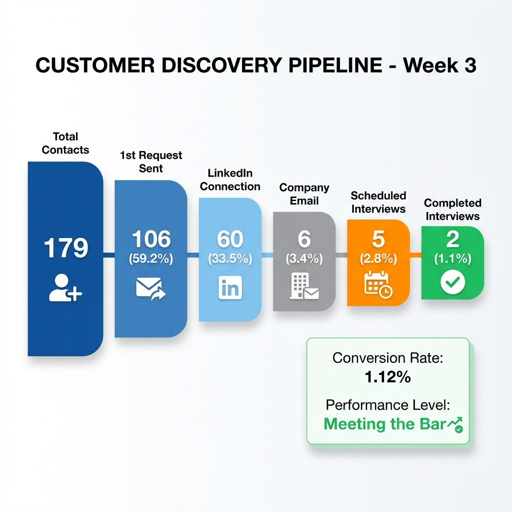
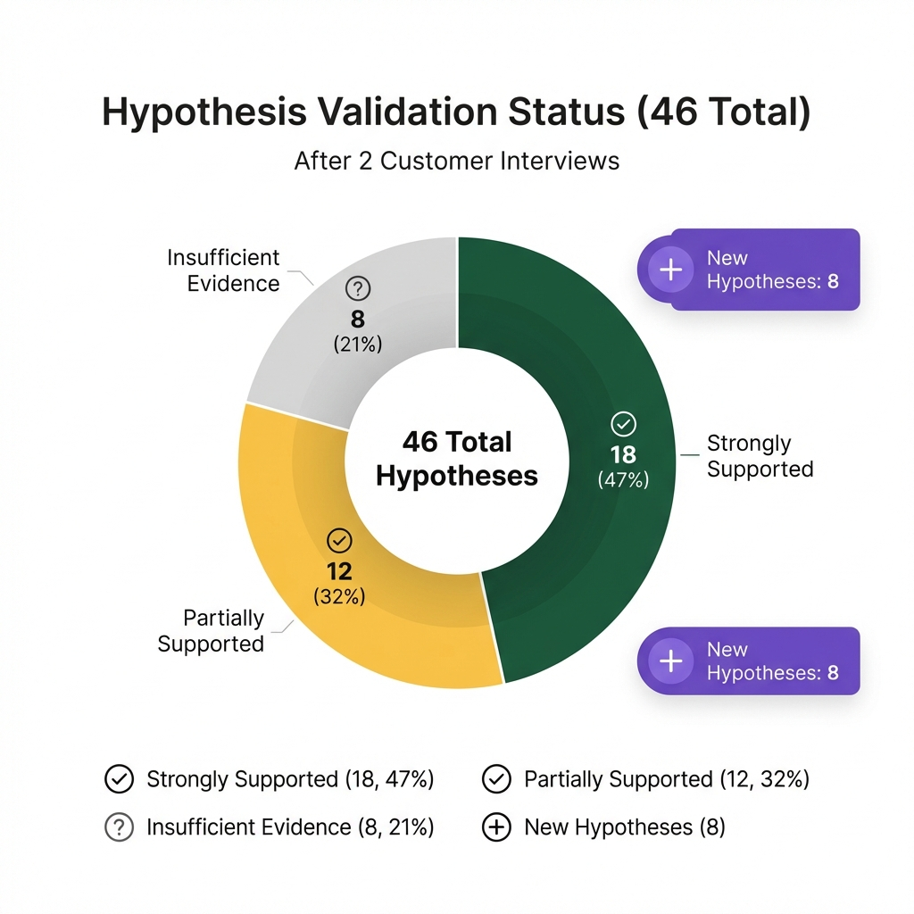
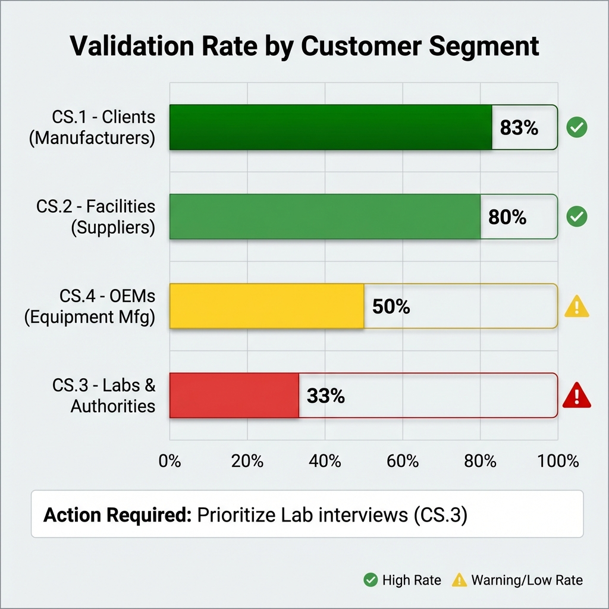
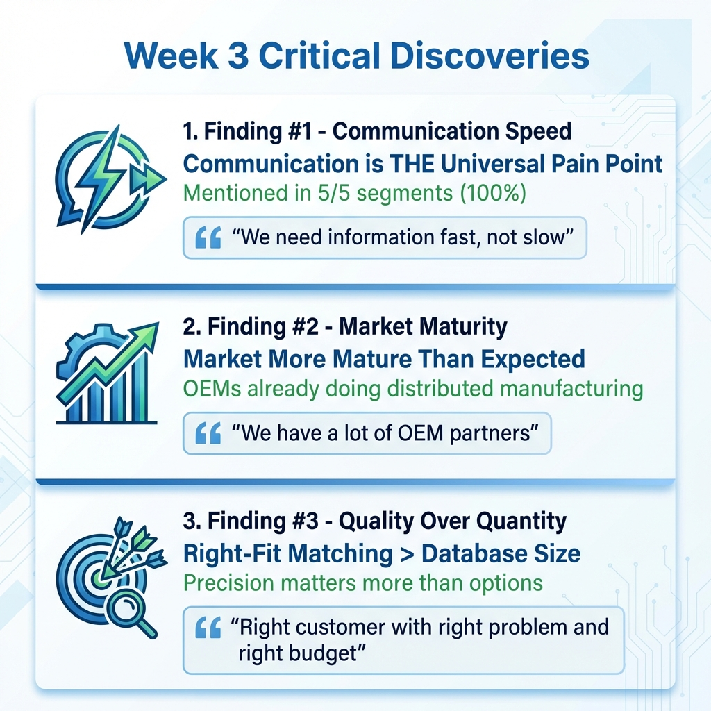
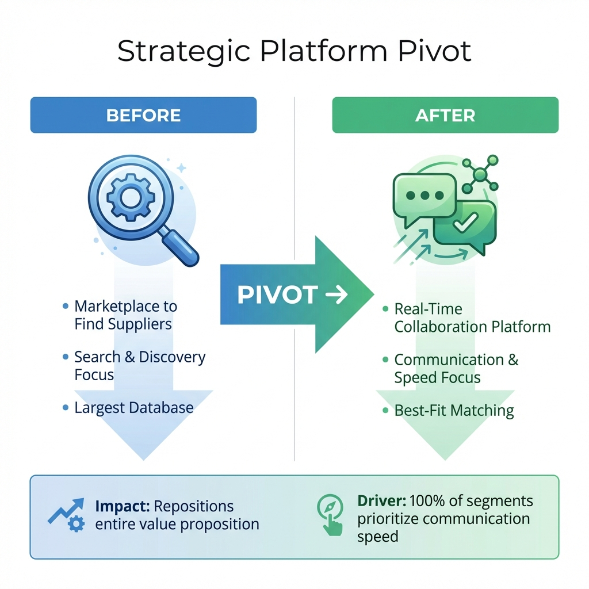
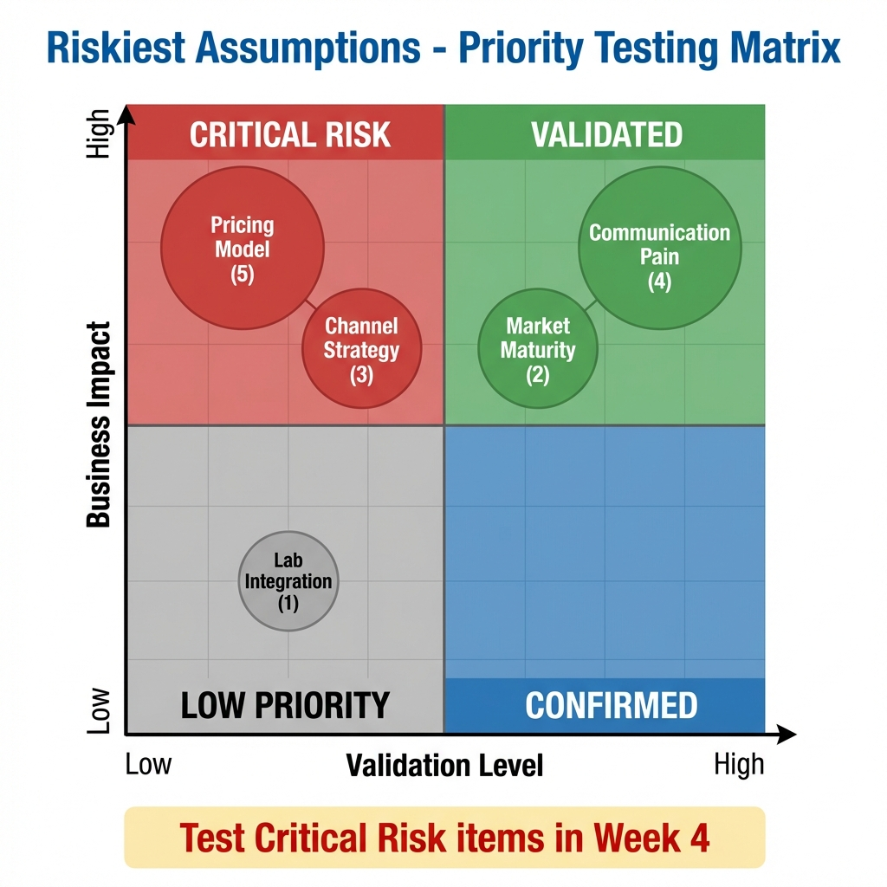

# Week 3 Visual Dashboard - Customer Discovery Summary

**Created:** January 27, 2026  
**Program:** Lab2Market - 3D Printing Ecosystem Platform  
**Purpose:** Visual presentation for Carol's Office Hours

---

## 📊 1. CUSTOMER DISCOVERY PIPELINE

**Key Metrics:**
- **Total Contacts:** 179
- **1st Request Sent:** 106 (59.2%)
- **LinkedIn Connection:** 60 (33.5%)
- **Company Email:** 6 (3.4%)
- **Scheduled Interviews:** 5 (2.8%)
- **Completed Interviews:** 2 (1.1%)

**Performance:** Meeting the Bar ⭐⭐⭐  
**Conversion Rate:** 1.12% (completed/total)

---

## 🎯 2. HYPOTHESIS VALIDATION STATUS

**After 2 Customer Interviews:**

- ✅ **Strongly Supported:** 18 hypotheses (47%)
- 🟡 **Partially Supported:** 12 hypotheses (32%)
- ❓ **Insufficient Evidence:** 8 hypotheses (21%)
- 🆕 **New Hypotheses Discovered:** 8

**Total:** 46 hypotheses across 5 customer segments

---

## 📈 3. VALIDATION BY CUSTOMER SEGMENT

**Validation Strength:**

| Segment | Rate | Status |
|---------|------|--------|
| **CS.1 - Clients (Manufacturers)** | 83% | ✅ Well Validated |
| **CS.2 - Facilities (Suppliers)** | 80% | ✅ Well Validated |
| **CS.4 - OEMs (Equipment Mfg)** | 50% | ⚠️ Moderate |
| **CS.3 - Labs & Authorities** | 33% | 🔴 **Action Required** |

**Critical Gap:** Labs segment is underrepresented. Need 5+ additional lab interviews in Week 4.

---

## 💡 4. CRITICAL DISCOVERIES FROM WEEK 3

### Finding #1: Communication Speed is THE Universal Pain Point
- **Evidence:** Mentioned in 5/5 segments (100%)
- **Quote:** *"We need information fast, not slow"*
- **Impact:** Primary value proposition differentiator

### Finding #2: Market More Mature Than Expected
- **Evidence:** OEMs already doing distributed manufacturing
- **Quote:** *"We have a lot of OEM partners"*
- **Impact:** Shift target from "enablement" to "optimization"

### Finding #3: Right-Fit Matching > Database Size
- **Evidence:** Quality over quantity in supplier matching
- **Quote:** *"Right customer with right problem and right budget"*
- **Impact:** Precision algorithm priority over large database

---

## 🔄 5. STRATEGIC PLATFORM PIVOT

### BEFORE → AFTER

**Before:**
- Marketplace to Find Suppliers
- Search & Discovery Focus
- Largest Database

**After:**
- Real-Time Collaboration Platform
- Communication & Speed Focus
- Best-Fit Matching

**Impact:** Repositions entire value proposition  
**Driver:** 100% of segments prioritize communication speed

**BMC Changes:**
- **Value Proposition:** Communication infrastructure + Matching (not just directory)
- **Key Resources:** Real-time messaging platform + Document sharing
- **Customer Relationships:** Active collaboration hub (not self-service marketplace)

---

## ⚠️ 6. RISKIEST ASSUMPTIONS - PRIORITY TESTING

### Critical Risk Zone (High Impact, Low Validation):

**🔴 Pricing Model (5 hypotheses - H33-H36)**
- Commission model acceptance
- Subscription pricing sensitivity
- Enterprise tier willingness to pay
- **Action:** Test with 15 interviews in Week 4

**🔴 Channel Strategy (3 hypotheses - H37-H38)**
- Conference effectiveness
- Thought leadership ROI
- **Action:** Ask discovery questions in all interviews

### Validated Zone (High Impact, High Validation):

**✅ Communication Pain (4 hypotheses)**
- Confirmed across ALL segments
- Primary differentiator identified

**✅ Market Maturity (2 hypotheses)**
- Distributed manufacturing already happening
- Target companies managing (not enabling)

### Low Priority Zone:

**Lab Integration (1 hypothesis)**
- Lower immediate impact
- Address after core validation

---

## 📋 WEEK 3 SUMMARY TABLE

| Metric | Value | Status |
|--------|-------|--------|
| **Outreaches This Week** | 179 | Meeting the Bar |
| **Interviews Completed** | 2 | On Track |
| **Conversion Rate** | 1.12% | Industry Standard |
| **Hypotheses Validated** | 18/46 (47%) | Strong Progress |
| **New Insights Discovered** | 8 | Excellent |
| **Critical Pivots Made** | 2 | Strategic |
| **Interviews Scheduled** | 5 | Good Pipeline |

---

## 🎯 CRITICAL INSIGHTS

### 1. Communication is THE Differentiator

**Evidence Strength:** 🔴🔴🔴🔴🔴 (100% of segments)

All 5 customer segments independently cited communication speed as their #1 pain point:
- **Clients:** "We need information fast, not slow"
- **Facilities:** "Transparency with customer is essential"
- **Labs:** "Communication gap between"
- **OEMs:** "Lead time is a big deal"
- **Authorities:** "Miscommunication causes problems"

**Strategic Implication:**  
Platform must be built as "Communication Platform First, Marketplace Second"

---

### 2. Price Discovery is THE Risk

**Evidence Strength:** ⚠️ (0% validation)

ALL pricing hypotheses remain completely untested:
- No data on commission acceptance
- No data on subscription willingness to pay
- No data on price sensitivity
- No data on budget ownership

**Strategic Implication:**  
Week 4 MUST focus on pricing validation with every interview.

---

### 3. Labs Require Special Approach

**Evidence Strength:** 🟡 (33% validation, n=2)

From Khashayar (Lab Researcher):
> *"Because of NDAs and confidentiality he can't share that much information"*

**Challenge:** Labs are restricted by client NDAs and can only share general workflow information, not specific project details.

**Strategic Implication:**  
Adjust interview approach:
- Focus on general processes (not specific projects)
- Target lab managers (not project engineers)
- Validate through public case studies
- Accept lower detail level

---

## ✅ WEEK 4 ACTION PLAN

### Primary Goal: Pricing Validation

**Target:** 15 new interviews  
**Focus:** Test pricing with ALL interviews

**Interview Breakdown:**
- **10 Procurement Managers** → Test subscription pricing (CS.1)
- **3 Facility Owners** → Test commission model (CS.2)
- **2 Lab Quality Managers** → Test lab subscription (CS.3)

### Artifacts to Create:

1. **Pricing Mockup** (3-tier comparison)
   - Basic: $10K/year
   - Pro: $20K/year
   - Enterprise: $50K/year

2. **Updated Value Prop Messaging** (communication-first)

3. **Interview Script v2.0** (with pricing questions)

### Success Criteria:

**Minimum:**
- Complete 15 interviews
- Test pricing in 100% of interviews
- Achieve ≥8/15 (53%) positive pricing response

**Stretch:**
- 20+ interviews
- Identify budget owners in 100% of conversations
- Map complete decision process for 10+ companies

---

## 📊 COMPARISON: WEEK 2 vs WEEK 3

| Metric | Week 2 | Week 3 | Change |
|--------|--------|--------|--------|
| Total Contacts | ~150 | 179 | +19% ↗️ |
| Completed Interviews | 1 | 2 | +100% ↗️ |
| Scheduled Interviews | 0 | 5 | +5 ↗️ |
| Hypotheses | 38 | 46 | +21% ↗️ |
| Segments Covered | 5 | 5 | Stable ➡️ |
| Critical Pivots | 0 | 2 | Strategic ↗️ |

**Trend:** Accelerating discovery and insights generation

---

## 🔮 NEXT MEETING PREVIEW

### For Week 4 Office Hours:

**Expected Metrics:**
- Outreaches: 200+ (target: "Strong" level)
- Completed Interviews: 15-20
- Conversion Rate: 7.5-10%
- Pricing Validation: ≥50% positive response

**Expected Findings:**
- Pricing model validation (or pivot)
- Channel strategy validation
- Budget owner identification
- Decision process mapping

**Expected Risks:**
- Pricing rejection → Need to revisit revenue model
- Channel ineffectiveness → Need new acquisition strategy
- Low conversion → Need to improve outreach quality

---

## 📎 SUPPORTING DOCUMENTS

All detailed analysis available in:

1. **`Carol_Office_Hours_Week3.md`** - Complete Q&A preparation
2. **`Hypothesis_Validation_Map.md`** - All 46 hypotheses detailed
3. **`Week3_Visual_Summary.md`** - Text-based summary
4. **`CRM_Metrics_Report.md`** - Detailed pipeline analysis

Images saved in: `/Lab2Market/Presentations/Week 3/`

---

**Prepared by:** Mahmoud Kiasari  
**Date:** January 27, 2026  
**Status:** Ready for Carol's Review ✅
